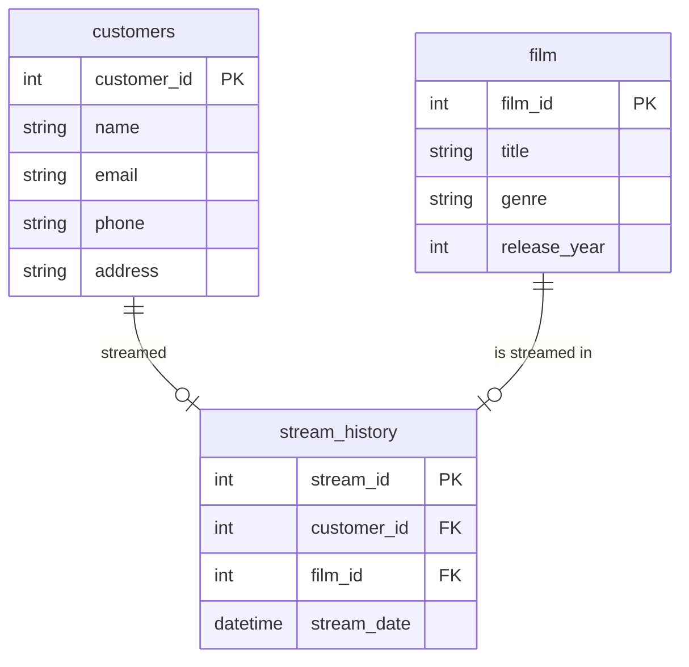

# Overview
A join is used when you want to select columns that span (are found in) multiple [[TABLE]]s *within the same* [[DATABASE]]. 

Joins need to be performed on one or more *join conditions*. A join condition tells the database how to match rows in the first table to rows in the second table. The conditions come after the `ON` key word.

The most common join condition is on the [[PRIMARY KEY]] of one database being equal to the matching [[FOREIGN KEY]] in the second database.

There are multiple different types of joins that have different use cases. The ones we cover are:
- JOIN also called INNER JOIN
- LEFT JOIN (and RIGHT JOIN, very similar)
- FULL OUTER JOIN
- ANTI-JOIN

## Demonstration of Each JOIN
Using the simple following example:
<div style="display: flex; justify-content: space-between;">

  <div style="width: 48%;">

    <h3>Table 1: employees</h3>
    <table>
      <thead>
        <tr>
          <th>employee_id</th>
          <th>name</th>
        </tr>
      </thead>
      <tbody>
        <tr>
          <td>1</td>
          <td>Rob</td>
        </tr>
        <tr>
          <td>2</td>
          <td>Javan</td>
        </tr>
        <tr>
          <td>3</td>
          <td>Mari</td>
        </tr>
        <tr>
          <td>4</td>
          <td>Ross</td>
        </tr>
      </tbody>
    </table>

  </div>

  <div style="width: 48%;">

    <h3>Table 2: employee_salaries</h3>
    <table>
      <thead>
        <tr>
          <th>employee_id</th>
          <th>salary</th>
        </tr>
      </thead>
      <tbody>
        <tr>
          <td>3</td>
          <td>12570</td>
        </tr>
        <tr>
          <td>4</td>
          <td>100000</td>
        </tr>
        <tr>
          <td>5</td>
          <td>55000</td>
        </tr>
        <tr>
          <td>6</td>
          <td>46000</td>
        </tr>
      </tbody>
    </table>

  </div>

</div>

The following show the results for each join on these tables (joining on employee_id).

  <div style="width: 32%;">

    <h3>INNER JOIN Result</h3>
    <table>
      <thead>
        <tr>
          <th>employee_id</th>
          <th>name</th>
          <th>salary</th>
        </tr>
      </thead>
      <tbody>
        <tr>
          <td>3</td>
          <td>Mari</td>
          <td>12570</td>
        </tr>
        <tr>
          <td>4</td>
          <td>Ross</td>
          <td>100000</td>
        </tr>
      </tbody>
    </table>

  </div>
*NOTE: No NULLs, missing information from both databases.*
  <div style="width: 32%;">

    <h3>LEFT JOIN Result</h3>
    <table>
      <thead>
        <tr>
          <th>employee_id</th>
          <th>name</th>
          <th>salary</th>
        </tr>
      </thead>
      <tbody>
        <tr>
          <td>1</td>
          <td>Rob</td>
          <td>NULL</td>
        </tr>
        <tr>
          <td>2</td>
          <td>Javan</td>
          <td>NULL</td>
        </tr>
        <tr>
          <td>3</td>
          <td>Mari</td>
          <td>12570</td>
        </tr>
        <tr>
          <td>4</td>
          <td>Ross</td>
          <td>100000</td>
        </tr>
      </tbody>
    </table>

  </div>
*NOTE: 
	- Contains all rows from left database.
	- Missing information from right databases.
	- The column from the right database is NULLABLE.*
  <div style="width: 32%;">

    <h3>FULL OUTER JOIN Result</h3>
    <table>
      <thead>
        <tr>
          <th>employee_id</th>
          <th>name</th>
          <th>salary</th>
        </tr>
      </thead>
      <tbody>
        <tr>
          <td>1</td>
          <td>Rob</td>
          <td>NULL</td>
        </tr>
        <tr>
          <td>2</td>
          <td>Javan</td>
          <td>NULL</td>
        </tr>
        <tr>
          <td>3</td>
          <td>Mari</td>
          <td>12570</td>
        </tr>
        <tr>
          <td>4</td>
          <td>Ross</td>
          <td>100000</td>
        </tr>
        <tr>
          <td>5</td>
          <td>NULL</td>
          <td>55000</td>
        </tr>
        <tr>
          <td>6</td>
          <td>NULL</td>
          <td>46000</td>
        </tr>
      </tbody>
    </table>

  </div>
*NOTE: 
	- Contains all information from both databases.
	- Rows are matched where possible, replace unmatched data with NULL.
	- The columns from both databases are NULLABLE.

# Syntax
### JOIN or INNER JOIN
```sql
SELECT
	table_1.column_1
	,table_2.column_2
	,table_1.column_1 + table_2.column_2 AS sum_of_columns
FROM
	table_1
JOIN -- or INNER JOIN
	table_2
ON
	table_1.primary_key = table_2.foreign_key
```

# Common use case
When a query requires data from 2 or more different tables. This is common in relational databases as data is separated out into related tables. 

It is common for multiple joins to be required. For example, if you want to find all the movies a customer has watched you will likely have to perform 2 or more joins. The data might look something like this:



So to get the data we want we will do the following:

`customer_table --join--> stream_history_table` 

This will create a new table with both the customer name/id, and their stream history. Let's call this `customer_stream_table` for now. Then,

`employee_stream_table --join--> film_table`

to create a table with all the movie names that a given customer has watched.

See below for a template solution to this problem.


# Example
```sql
SELECT
	c.customer_name
	,f.movie_title
FROM
	customer_table as c
LEFT JOIN
	stream_history_table as s
ON
	c.customer_id = s.customer_id
LEFT JOIN
	film_table as f
ON
	s.film_id = f.film_id
```

### Explanation
We join customers to streams on `customer_id` because this is a common key between the two tables: it is the primary key of customers and a foreign key of streams. 

We use a `LEFT JOIN` because we want to prioritise getting a result for each customer (the table on the left), even if there are no results in the right table. 

We can't use an `INNER JOIN` because this wouldn't return a row for customers that have not streamed anything yet.

We can't use a `FULL OUTER JOIN` because we don't want to return rows for streams do not have an associate customer.

We use a `LEFT JOIN` for the second join for a similar reason. We do not want to retrieve rows for films that have not been streamed yet.

# Intuition
When tackling JOINs, think through these steps (loosely in this order):
1. What tables to I need to retrieve all the data that I want 
	 -- This will tell you which tables need to be joined
2. Of the tables that need to be joined, what columns do they have in common 
	-- This will tell you which columns you want to join on
3. Are there any other conditions I want to add when joining?
	-- This will tell you what other conditions to add to your *join condition*.
4. For which columns do I want to keep every row/allow values to be [[NULL]]?
	1. If I don't want any `NULL`s, use `INNER JOIN` - this may ignore (not retrieve) rows from both tables.
	2. If I want to keep all the rows for the first (left) table, but don't mind columns from the second (right) table being `NULL`, use `LEFT JOIN`. Same for `RIGHT JOIN` but with first/second table swapped.
	3. If I want all rows in both table to be retrieved, even if a match cannot be found between every row, use `FULL OUTER JOIN`.


#kubricksqlnote
